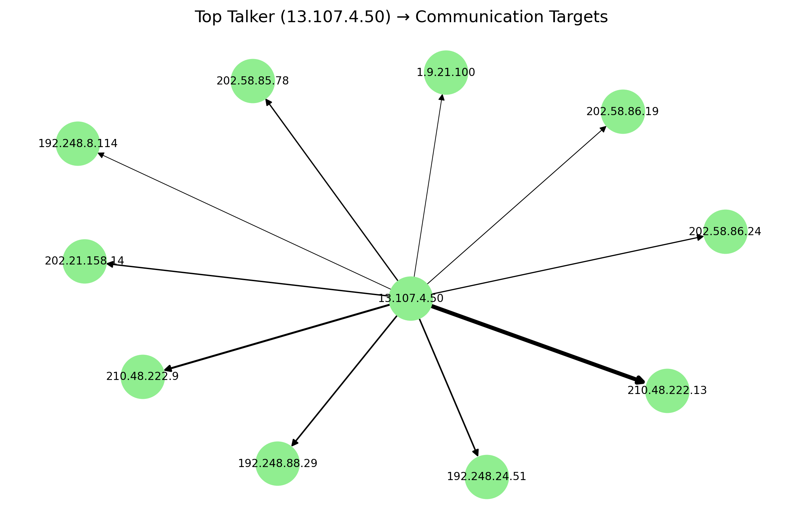

---

````md
<div align="center">

<h1>TrafficFlow-Analyzer</h1>

<p>
<b>A lightweight Python network traffic log analyzer</b> for sFlow/NetFlow-style CSV exports.<br/>
It identifies top talkers/listeners, protocol distribution, top application ports, and a sampling-aware total traffic estimate.<br/>
Exports results to <b>Excel</b>, generates <b>PNG</b> visualizations, and writes a <b>plain-text</b> report.
</p>

<!-- Optional banner: place at assets/banner.png -->
<!--  -->

<p>
  
  
  
</p>

</div>

---

## Table of Contents
- [Quick Start](#quick-start)
- [Outputs](#outputs)
- [Key Features](#key-features)
- [Input CSV Format](#input-csv-format)
- [Command Line Arguments](#command-line-arguments)

---

## Quick Start

### Install
```bash
pip install pandas matplotlib networkx xlsxwriter
````

### Run

```bash
python lab4_analyzer.py Data_2.csv --top 5 --default-sampling 2048
```

---

## Outputs

### Files Generated

| Type    | Filename(s)                                                                     |
| ------- | ------------------------------------------------------------------------------- |
| Excel   | `lab4_results.xlsx`                                                             |
| Figures | `lab4_4E_bar.png`, `lab4_4E_talker_network.png`, `lab4_4E_listener_network.png` |
| Report  | `lab4_report.txt`                                                               |

### Excel Sheets inside `lab4_results.xlsx`

| Sheet             | What it contains                                     |
| ----------------- | ---------------------------------------------------- |
| `4A_Talkers`      | Top talkers (src IPs) + optional reverse DNS label   |
| `4A_Listeners`    | Top listeners (dst IPs) + optional reverse DNS label |
| `4B_Transport`    | Protocol distribution + percentages                  |
| `4C_Applications` | Top destination ports + service mapping              |
| `4D_Traffic`      | Sampling-aware total traffic estimate (MB & MiB)     |
| `4E_Pairs`        | Top bidirectional communication pairs                |

---

## Visualizations

> Recommended: put the generated PNGs under `assets/` and commit them, so they render nicely on GitHub.

<div align="center">
  
  
</div>

<div align="center">
  
</div>

---

## Key Features

### 1) Top Talkers / Top Listeners (by packet count)

* **Top Talkers**: most frequent `src_IP`
* **Top Listeners**: most frequent `dst_IP`
* Optional reverse DNS lookup (`socket.gethostbyaddr`) to attach a best-effort `Organisation/hostname` label
  *(may fail and fall back to `Unknown`)*

**Excel output**

* `4A_Talkers`: `Rank, IP address, # of packets, Organisation`
* `4A_Listeners`: `Rank, IP address, # of packets, Organisation`

---

### 2) Transport Protocol Breakdown (IP protocol field)

* Counts `IP_protocol` values (e.g., `6/TCP`, `17/UDP`)
* Maps common protocol numbers via an internal `PROTO_MAP`
* Outputs both packet counts and **percentages of total traffic**

**Excel output**

* `4B_Transport`: `Header value, Transport layer protocol, # of packets, % of total`

---

### 3) Top Applications / Services (by destination port)

* Finds the most common `dst_port` values (Top-N)
* Maps common ports to service names using an internal `PORT_MAP` (HTTP/HTTPS/DNS/SSH, etc.)
  Unknown ports remain `Unknown`

**Excel output**

* `4C_Applications`: `Destination IP port number, # of packets, Service`

---

### 4) Sampling-aware Total Traffic Estimation

* Estimates total bytes using `packet_size × sampling_rate` per record
* Reports totals in both:

  * **MB (decimal)** = bytes / 1e6
  * **MiB (binary)** = bytes / 1024²
* If `sampling_rate` is missing or 0, the script uses `--default-sampling` (default: `2048`)

**Excel output**

* `4D_Traffic`: `Total Traffic (MB, 10^6), Total Traffic (MiB, 1024^2)`

---

### 5) Top Bidirectional Communication Pairs

* Treats `(src_IP, dst_IP)` as an undirected pair by sorting the two IPs
* Aggregates A→B and B→A into one entry, ranked by total packet counts

**Excel output**

* `4E_Pairs`: `# of packets, Host1, Host2`

---

## Text Report (TXT)

* `lab4_report.txt`

  * Prints the Top bidirectional pairs table (`pair_counts.to_string()`)
  * Lists the generated PNG filenames

> Note: The report header string currently contains legacy wording.
> You can rename it by editing the corresponding `write()` line in the script.

---

## Input CSV Format

The script assumes the CSV has **no header row** and supports **two layouts** by checking the number of columns in the first line.

### 20-column layout (default)

`type, sflow_agent_address, inputPort, outputPort, src_MAC, dst_MAC, ethernet_type, in_vlan, out_vlan, src_IP, dst_IP, IP_protocol, ip_tos, ip_ttl, src_port, dst_port, tcp_flags, packet_size, IP_size, sampling_rate`

### 21-column layout

If 21 columns are detected, an extra trailing column named `extra` is added (core analysis is unaffected).

---

## Command Line Arguments

* `csv_path` (positional): path to the input CSV log
* `--top`: Top-N size (default: `5`)
* `--default-sampling`: fallback sampling rate when missing/0 (default: `2048`)

```

---

### 你只需要做两步就能显示出来
1) 在仓库根目录新建文件夹：`assets/`  
2) 把三张图移动/复制进去，并保持文件名完全一致：  
   - `assets/lab4_4E_bar.png`  
   - `assets/lab4_4E_talker_network.png`  
   - `assets/lab4_4E_listener_network.png`

> 如果你不想建 `assets/`，也可以把图片放根目录，然后把 README 里的路径从 `assets/xxx.png` 改成 `xxx.png`。

如果你把你 repo 里图片实际放置的位置（根目录还是 assets）告诉我，我也可以把路径给你改成最匹配你当前结构的一版。
```
